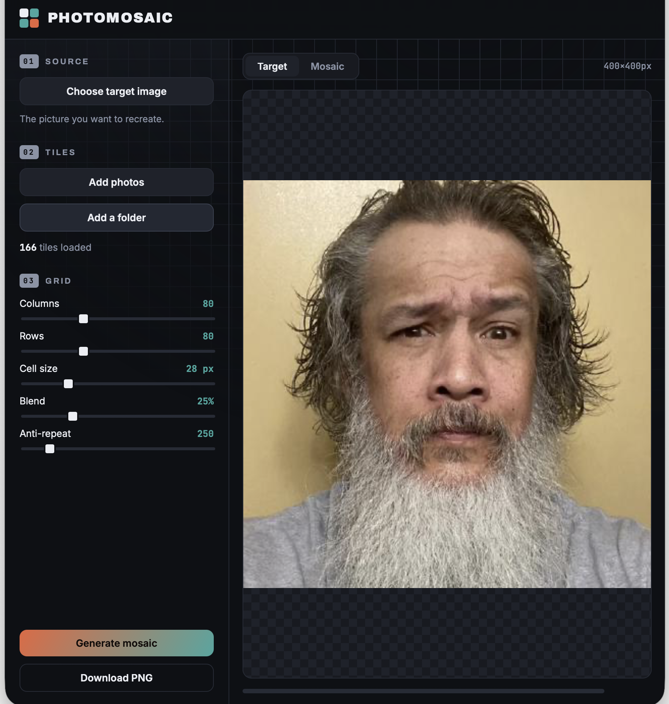

# Photomosaic PWA

A browser-based **photomosaic generator** — recreate one picture out of a grid of your own photos. It's a Progressive Web App: installable, works offline, and **everything runs locally**. Your images are never uploaded; all the decoding and drawing happens on your device with Canvas.

This is the web counterpart of the JavaFX desktop app. The mosaic algorithm is the same; the browser's file/photo picker takes the place of the desktop `PhotoProvider`.




---

## Run it

Service workers and installability need the app to be **served over HTTP(S)** — opening `index.html` from `file://` won't work. Any static server does:

```bash
cd photomosaic-pwa
python3 -m http.server 8080
# then open http://localhost:8080
```

`localhost` counts as a secure context, so the service worker and the **Install** button work there. To deploy, drop the folder on any static host (GitHub Pages, Netlify, Cloudflare Pages,…) over HTTPS.

---

## Use it

1. **Choose target image** — the picture to recreate. (You can also drag an image onto the canvas.)
2. **Add photos** or **Add a folder** — the tiles to build it from. On a phone, *Add photos*
   opens your photo library or camera.
3. Tune the **grid**: columns × rows, cell size, colour blend, and anti-repeat.
4. **Generate mosaic**, then **Download PNG**.

Tip: more tiles and a higher *blend* both improve how faithful the result looks; *anti-repeat* trades a little colour accuracy for more variety in which photos get used.

---

## What's in here

```
photomosaic-pwa/
├── index.html              app shell + layout
├── styles.css              design tokens + responsive UI
├── app.js                  mosaic engine + UI wiring + SW registration
├── manifest.webmanifest    installable-app metadata
├── sw.js                   offline-first service worker (caches the shell)
├── icons/                  192 / 512 / maskable / favicon
└── README.md
```

---

## How it works

- **Tile signatures** — each tile photo is downscaled to 8×8 and averaged to a single RGB.
- **Per-cell colours** — the target is drawn into a `columns × rows` offscreen canvas, so each pixel is the average colour of one cell.
- **Matching** — every cell picks the nearest tile by a *redmean-weighted* colour distance (a cheap perceptual approximation), with an optional penalty that discourages reusing the same photo too often.
- **Compositing** — the chosen tile is drawn scaled into the cell, then optionally washed with a translucent layer of the cell's true colour (the *blend* control).

Generation runs in row-sized chunks with a frame yield between rows, so the progress bar updates and the UI stays responsive even on large grids.

### Ideas for later
- A **Web Worker + OffscreenCanvas** path for very large outputs.
- **Lab / CIEDE2000** matching for more faithful colour.
- A **k-d tree** over tile signatures for big libraries.
- **File System Access API** to remember a chosen tile folder between sessions.
